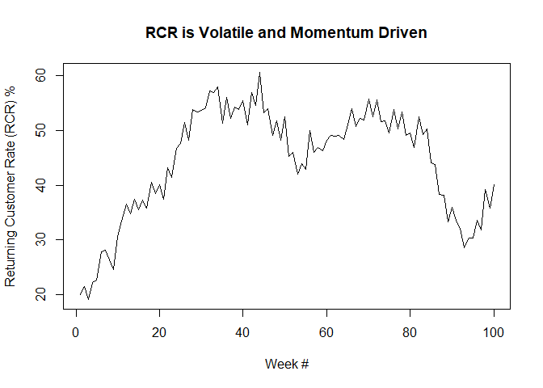
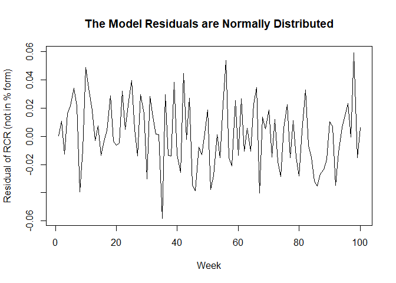
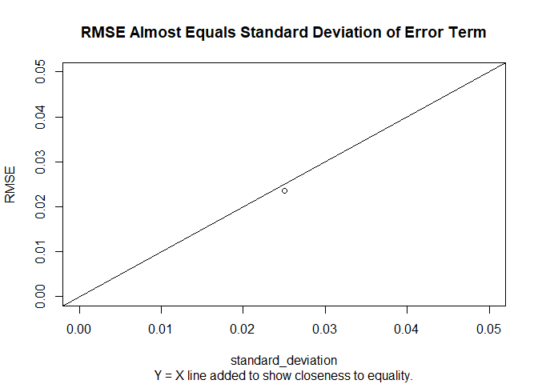
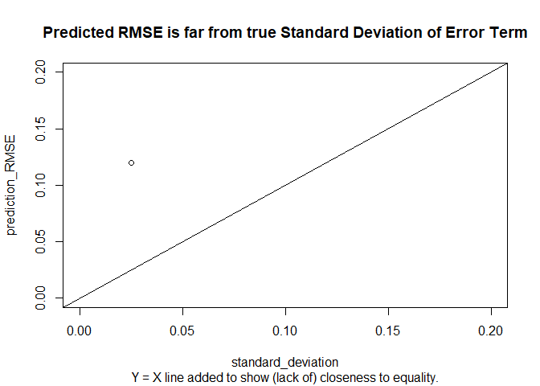
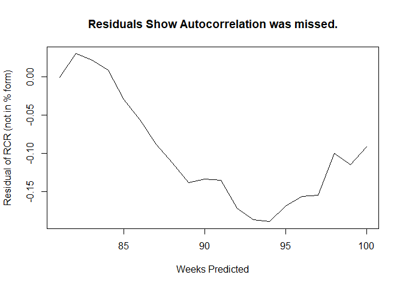
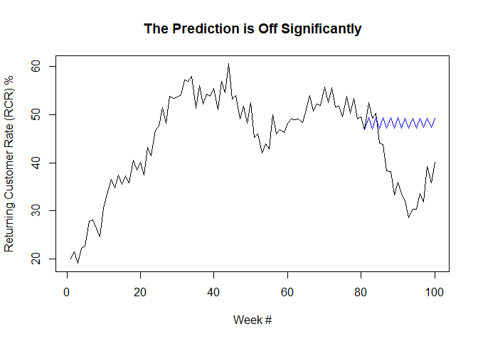
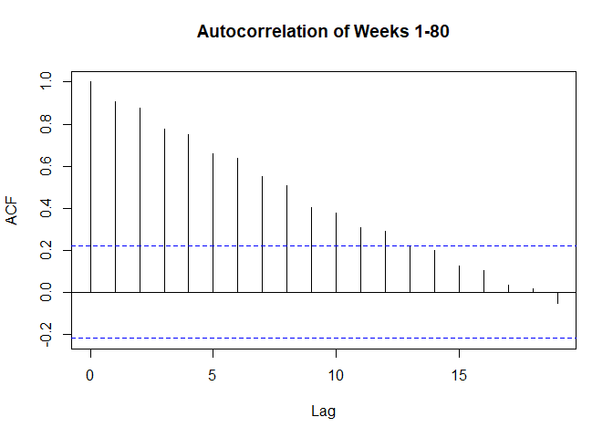
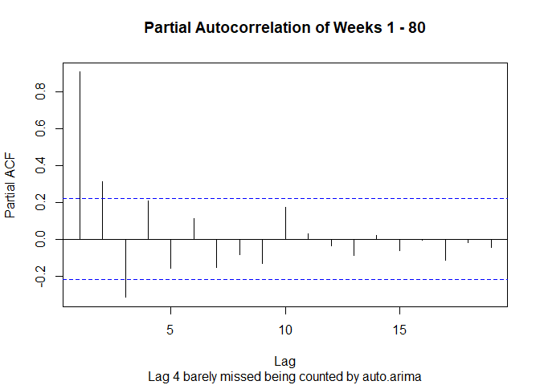

## Intro 

Someone on LinkedIn messaged me about a problem they were having with 
estimating the return customer rate for a retail client of theirs, especially
given the data was non-stationary (i.e. mean and variance changes). They were
really worried about accuracy and were saying that they couldn't get their 
root mean squared error (RMSE) down to their desired 0.01 level. I told 
them that the underlying true phenomenon might have randomness that exceeds
that amount and that they should look at estimating their model's accuracy
in the context of performance on data it hasn't seen. Of course, with COVID-19
there may also be a structural shift that their model would not correctly 
expect (i.e. the data before COVID-19 may have low relevance today.)

This code is an sampling of what RMSE is and how time series modeling should 
work. It does not get into structural shifts nor high-accuracy time series 
estimates, e.g. Recurrent Neural Networks. It's just focused on ARIMA, and RMSE.
Note: It does not deal with non-stationarity directly, but the lessons 
should still be usable there too. On the small 100 week sample, it may look 
non-stationary, but the fundamental data generation process is stationary (you 
can check this by changing n to a larger number, e.g. 100,000+)

## Data Simulation 

For simplicity this simulated data is at the weekly level, with bi-weekly cycles
(i.e. in the retail context, people get paid every two weeks, so we would expect
the revenue to cycle based on this real-life cycle.) 

Simulating Returning Customer Rate (rcr) at the weekly level for 100 weeks,
I start with 20% of sales are from returning customers, but in reality this 
changes over time and may even be increasing due to some exogenous factor, 
such as the store becoming popular and customers becoming more loyal
(or more negatively,the store is no longer appealing to anyone but their 
most loyal fans, always put KPIs in business context!). 

For odd-number weeks, sales are lower than the previous week, and for 
even-number weeks, sales are higher than the previous week (payday cycle).


```r
library(forecast) # This is for the modeling later, just loading it now. 
n <- 100 
standard_deviation <- 0.025
rcr <- integer(length = n)
rcr[1] <- 0.2 # 20% of sales are returning customers in my initial week. 
set.seed(4)
# For reproducibility, but note, different seeds may get VERY different 
# results in small sample sizes.

for(i in 2:n){
  m <- ifelse(i %% 2 == 0, yes = 1.05, no = 0.95)
  rcr[i] <- m*rcr[i-1] + rnorm(n = 1,mean = 0,sd = standard_deviation)
}

plot(rcr*100, type = "l", main = "RCR is Volatile and Momentum Driven",
     xlab = "Week #", 
     ylab = "Returning Customer Rate (RCR) %")
```

<!-- -->


## Modeling 

For simplicity, I just checked out what the forecast packages's auto.arima 
outputs. It returns an AR(4) model (when n = 100) with appropriate bi-weekly
patterns,i.e. that odd number weeks are negatively autoreggressive and even 
number weeks are positively autoregressive. The errors are relatively normally 
distributed as well. 


```r
RCR_model <- auto.arima(rcr)
message("The model  identified the pay cycle pattern in the coefficients.")
```

```
## The model  identified the pay cycle pattern in the coefficients.
```

```r
RCR_model$coef
```

```
##         ar1         ar2         ar3         ar4 
## -0.08845998  0.26481548 -0.24019586  0.28335746
```

```r
plot(RCR_model$residuals,
     main = "The Model Residuals are Normally Distributed", 
     xlab = "Week", ylab = "Residual of RCR (not in % form)")
```

<!-- -->

## Assessing the RMSE 

RMSE is not a model accuracy metric and that can be confusing to people since
it sounds like a function of residuals, which sounds like a measure of error. 
And what's an accuracy metric besides measuring how wrong you are? 

RMSE is an estimate of the true randomness of the data. When the residuals
are normally distributed it estimates the standard deviation of the residuals. 
This is totally different than measuring how correct or incorrect your model is.
Your model accuracy is a function of how wrong it is in *predicting* values
it hasn't seen before. 

Notice how close the RMSE (0.023) is to the standard deviation set above (0.025). 


```r
RMSE <- sqrt( mean ( RCR_model$residuals ^2 ) )
message(
  paste0("The RMSE should be close to the standard deviation of the 
         error term: ", standard_deviation,
         " RMSE: ", round(RMSE,digits = 4))
)
```

```
## The RMSE should be close to the standard deviation of the 
##          error term: 0.025 RMSE: 0.0235
```

```r
plot(x = standard_deviation, y = RMSE, 
     main = "RMSE Almost Equals Standard Deviation of Error Term",
     sub = "Y = X line added to show closeness to equality.",
     ylim = c(0,0.05), xlim = c(0,0.05))
abline(a = 0, b = 1)
```

<!-- -->

## Making a Predictive Model 

To assess a specific model's accuracy, let's make an 80/20 train/test split 
and identify how auto.arima performs in predicting the hidden data. 


```r
train_ <- rcr[1:floor(0.8 * n)]
test_ <- rcr[(floor(0.8 * n)+1):n ]

RCR_prediction_model <- auto.arima(train_)
RCR_prediction_model$coef
```

```
##         ar1         ar2         ar3         ma1 
## -0.89375852  0.04574315 -0.04568002  0.80595496
```

Unfortunately, given the small sample size (n = 100), auto.arima picks up a moving 
average term; but it correctly gets the bi-weekly pattern. We should expect 
the model to fail to revert to the mean and instead assume continued growth. 
I'm saying that without having checked though, let's find out how wrong it 
is due to this moving average. 


```r
RCR_predictions <- predict(RCR_prediction_model,
                           n.ahead = length(test_) )
residuals <- test_ - RCR_predictions$pred

prediction_RMSE <- sqrt ( mean ( residuals^2 ) )
plot(x = standard_deviation, y = prediction_RMSE, 
     main = "Predicted RMSE is far from true Standard Deviation of Error Term",
     sub = "Y = X line added to show (lack of) closeness to equality.",
     ylim = c(0,0.2), xlim = c(0,0.2))
abline(a = 0, b = 1)
```

<!-- -->

We'll know the model is bad given how correlated the residuals are. 


```r
plot(residuals,
     main = "Residuals Show Autocorrelation was missed.",
     xlab = "Weeks Predicted", ylab = "Residual of RCR (not in % form)"
     )
```

<!-- -->

```r
plot(rcr*100, type = "l", main = "The Prediction is Off Significantly",
     xlab = "Week #", 
     ylab = "Returning Customer Rate (RCR) %")
points(x = (floor(0.8 * n)+1):n,
       y = RCR_predictions$pred*100,
       type = "l", col = "blue")
```

<!-- -->

Of course, we could've guessed the moving average term was wrong by checking 
out the ACF and PCF (which shows AR(4) barely missed significance),
but that's a separate topic. 


```r
acf(train_, main = "Autocorrelation of Weeks 1-80")
```

<!-- -->

```r
acf(train_, type = "partial",
    main = "Partial Autocorrelation of Weeks 1 - 80", 
    sub = "Lag 4 barely missed being counted by auto.arima")
```

<!-- -->
